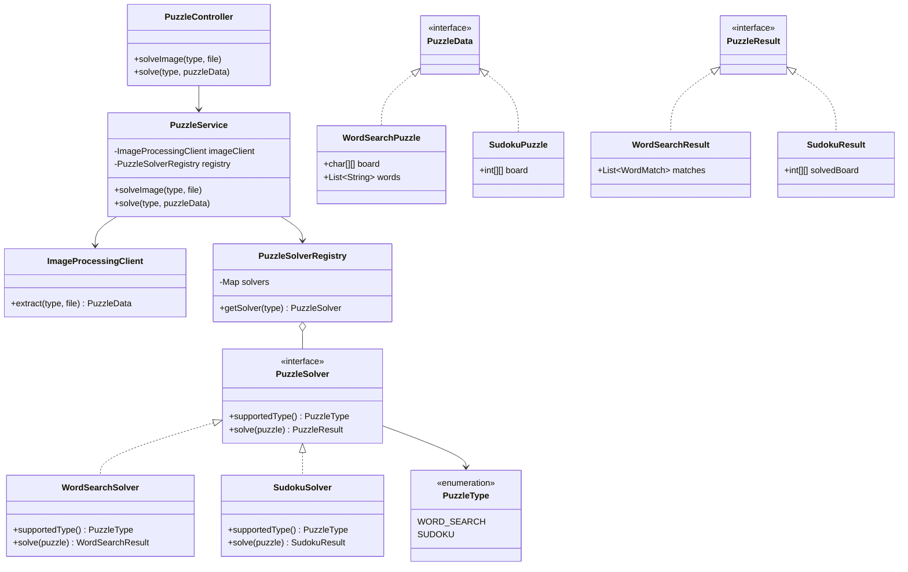

```mermaid
classDiagram
    direction TB

    class PuzzleController {
        +solveImage(type, file)
        +solve(type, puzzleData)
    }

    class PuzzleService {
        -ImageProcessingClient imageClient
        -PuzzleSolverRegistry registry
        +solveImage(type, file)
        +solve(type, puzzleData)
    }

    class ImageProcessingClient {
        +extract(type, file) PuzzleData
    }

    class PuzzleSolverRegistry {
        -Map solvers
        +getSolver(type) PuzzleSolver
    }

    class PuzzleType {
        <<enumeration>>
        WORD_SEARCH
        SUDOKU
    }

    class PuzzleSolver {
        <<interface>>
        +supportedType() PuzzleType
        +solve(puzzle) PuzzleResult
    }

    class WordSearchSolver {
        +supportedType() PuzzleType
        +solve(puzzle) WordSearchResult
    }

    class SudokuSolver {
        +supportedType() PuzzleType
        +solve(puzzle) SudokuResult
    }

    class PuzzleData {
        <<interface>>
    }

    class PuzzleResult {
        <<interface>>
    }

    class WordSearchPuzzle {
        +char[][] board
        +List~String~ words
    }

    class SudokuPuzzle {
        +int[][] board
    }

    class WordSearchResult {
        +List~WordMatch~ matches
    }

    class SudokuResult {
        +int[][] solvedBoard
    }

    PuzzleController --> PuzzleService

    PuzzleService --> ImageProcessingClient
    PuzzleService --> PuzzleSolverRegistry

    PuzzleSolverRegistry o-- PuzzleSolver

    PuzzleSolver <|.. WordSearchSolver
    PuzzleSolver <|.. SudokuSolver

    PuzzleData <|.. WordSearchPuzzle
    PuzzleData <|.. SudokuPuzzle

    PuzzleResult <|.. WordSearchResult
    PuzzleResult <|.. SudokuResult

    PuzzleSolver --> PuzzleType
```