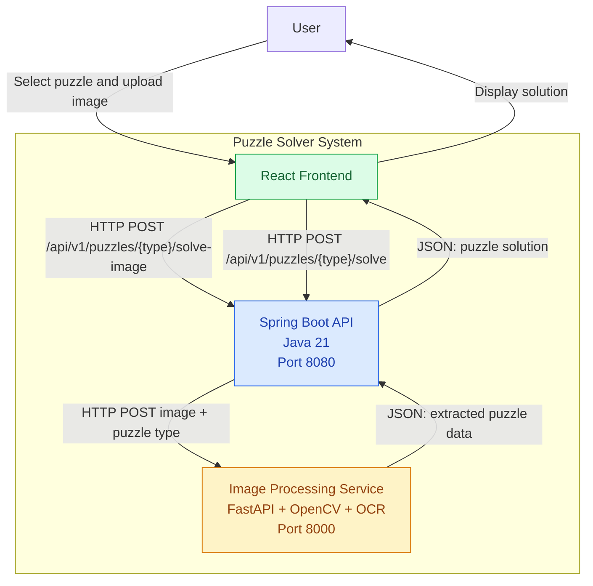

```mermaid
flowchart TB
    User["User"]

    subgraph System["Puzzle Solver System"]

        React["React Frontend"]

        Java["Spring Boot API<br/>Java 21<br/>Port 8080"]

        Python["Image Processing Service<br/>FastAPI + OpenCV + OCR<br/>Port 8000"]

    end

    User -->|"Select puzzle and upload image"| React

    React -->|"HTTP POST /api/v1/puzzles/{type}/solve-image"| Java

    React -->|"HTTP POST /api/v1/puzzles/{type}/solve"| Java

    Java -->|"HTTP POST image + puzzle type"| Python

    Python -->|"JSON: extracted puzzle data"| Java

    Java -->|"JSON: puzzle solution"| React

    React -->|"Display solution"| User

    style React fill:#dcfce7,stroke:#16a34a,color:#166534
    style Java fill:#dbeafe,stroke:#2563eb,color:#1e40af
    style Python fill:#fef3c7,stroke:#d97706,color:#92400e
```